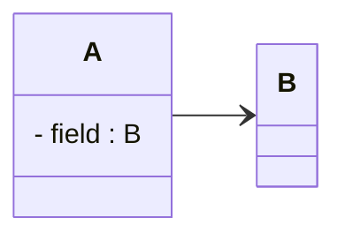
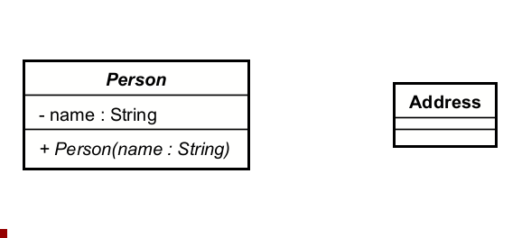
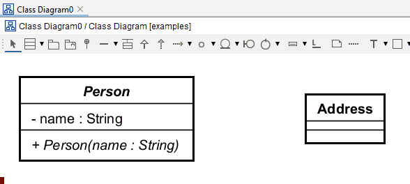

# Association Relationship

The association is the most common relationship, and is shown in most diagrams.

## UML Format
The association in UML is a **solid line** with an "open" arrowhead at one end, connecting two classes.
Generally, you should also show the field variable in the class that has the association, for clarity.

Notice the arrow type and direction. The arrow starts at the class that has the field variable, and points to the class that is the type of the field variable.

When the refence includes a _single_ target, we do not show the multiplicity on the relationship line. It is then implied.

## Adding an association in Astah

### Mouse over

Again, you can use the mouse over option, select the association arrow, and drag it to the target class. 

### Toolbox

Or, select the association tool from the toolbar at the top, make sure the correct arrow type is selected, then click the initial class, and then the target class.

