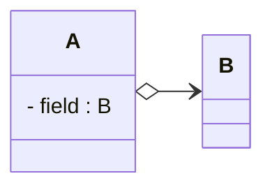

# Aggregation Relationship

**Aggregation** is a "has-a" relationship where one class contains or "owns" another class as a part, but the contained object can exist independently. The ownership is stronger than an association.

## UML Format
The aggregation in UML is a **solid line** with an "open" diamond at one end and an "open" arrowhead at the other end, connecting two classes.

## Adding an aggregation in Astah

This is found in the same place as the association tool, on the previous page.