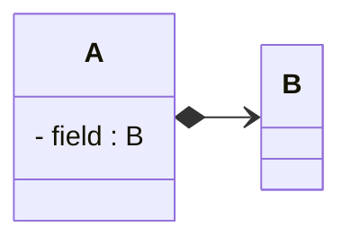

# Composition Relationship

**Composition** is a strong "has-a" relationship where one class contains another class as a part, and the contained object cannot exist independently. When the parent is destroyed, the contained object is also destroyed. This represents a whole-part relationship with strong ownership.

## UML Format
The composition in UML is a **solid line** with a "filled" diamond at one end and an "open" arrowhead at the other end, connecting two classes.

## Adding a composition in Astah

This is found in the same place as the association tool, on a previous page.

