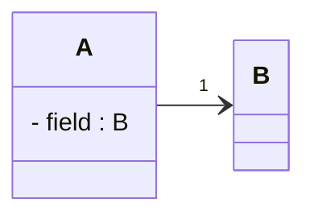
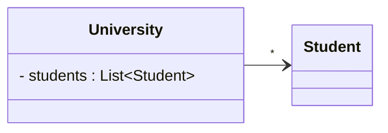
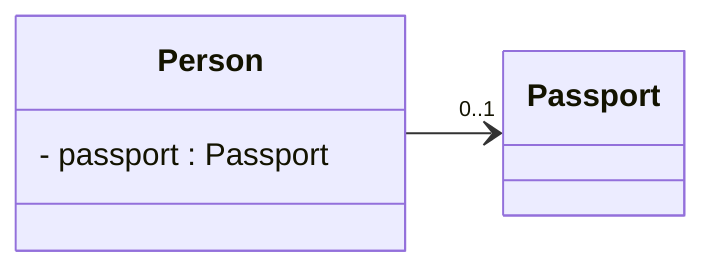
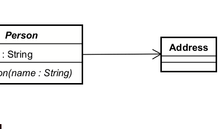
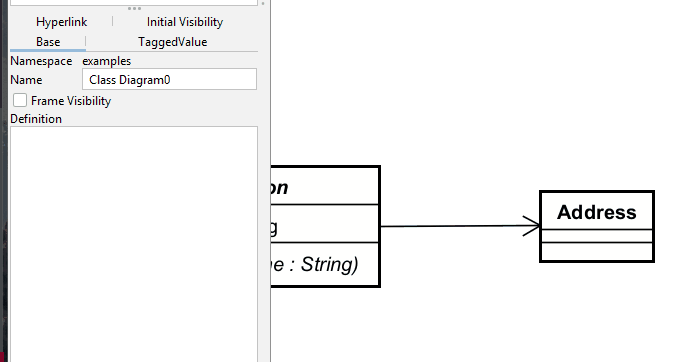

# Multiplicities on relationships

Sometimes a relationship indicates that one entity can be related to zero, one, or many other entities. This is expressed as a multiplicity on the relationship line.

A multiplicity consists of an upper and lower cardinality, separated by `..`. The upper cardinality is the maximum number of instances of the entity that can be related to the other entity. The lower cardinality is the minimum number of instances of the entity that must be related to the other entity.

## UML Format
The multiplicity is added to the _end_ of the relationship arrow, at the arrow head. So, we update the UML as follows:

In this example, class A has exactly one instance of class B.

## Common Multiplicities

Here are the most common multiplicity notations:

- `1` - exactly one
- `0..1` - zero or one
- `*` or `0..*` - zero or many
- `1..*` - one or many

## Examples

A university can have zero or many students. This is a way to express that it is _optional_ for a Person to have a passport.

A person can have zero or one passport.

## Adding multiplicities in Astah

### Mouse over

In Astah, if nothing is selected, you can mouse over a relationship line, and you will see a little "*" icon. Click it and select from the menu.

Once there is a present multiplicity, you can click on it, to edit it.

### Left side panel

You can also select the relationship line, and then the tab for "Association End A" or "Association End B". The "A" side was where you dragged the line _from_. Here is an option for setting the multiplicity.

