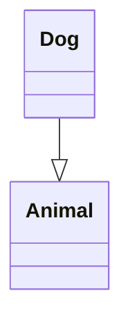
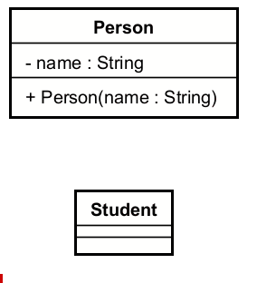
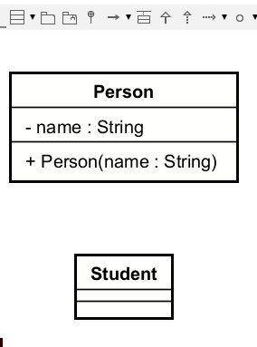

# Inheritance Relationship

**Inheritance** is a "is-a" relationship where a class inherits properties and behaviors from a parent class. The child class is a more specialized version of the parent class.

## UML Format
The inheritance in UML is a **hollow triangle arrow** pointing from the child class to the parent class. The line is solid, and the arrowhead is hollow.

In this example, `Dog` and `Cat` inherit from `Animal`. The arrow points from the child classes to the parent class.

## Adding inheritance in Astah

You have two approaches: mouse over, or toolbar menu.

In Astah, it is named "generalization".

### Mouse over

If nothing is selected, you can mouse over a class box, close to an edge, and you will see a little [ ▼ ] icon.\
Select the inheritance arrow, and drag it to the parent class.

### Toolbar menu

It is also available from the toolbar menu. Select the inheritance tool from the toolbar, and click the child class, and then the parent class.

