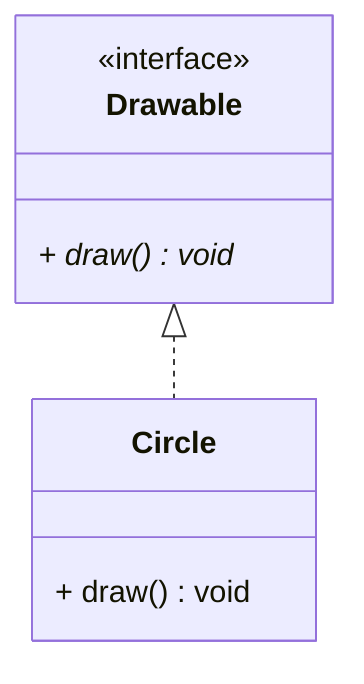
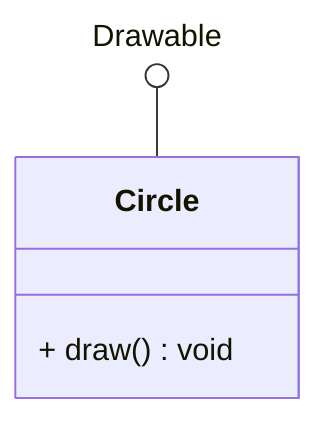
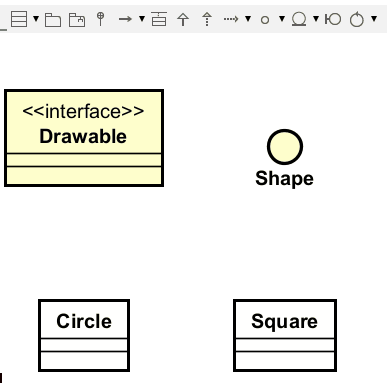

# Implements Interface Relationship

**Implements** is a relationship where a class implements an interface. This is a "is-a" relationship where a class implements the contract of an interface.

## UML Format

The implements relationship in UML is shown with a **dashed line with a hollow triangle arrow** pointing from the implementing class to the interface. This is called "realization" in UML terminology.

In this example, `Circle` implements the `Drawable` interface.

Alternatively, in Mermaid, you can use the lollipop notation. If your interface is represented as a lollipop, the line should just be a solid line, with no arrowhead.\
I recommend using the lollipop notation, when you are implementing an interface from the Java library, and that interface is commonly known.

The lollipop notation is more compact and shows that the class implements the interface.

## Adding implements in Astah

It is the same arrow used, no matter if your interface is represented by a box or a lollipop.

There is no mouse over option. You can select the implements tool from the toolbar, and click the implementing class, and then the interface.

