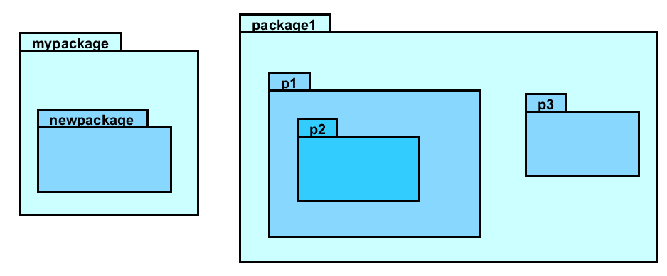
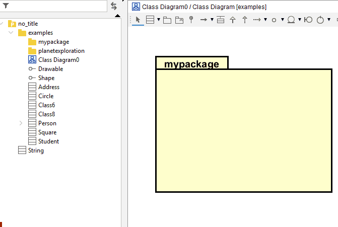
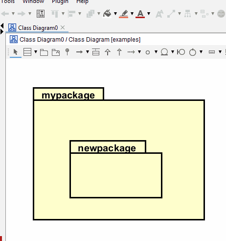

# Packages

In your code you organize your classes into packages. In UML, you can also represent packages.

This is a box, found in the toolbar menu.

## Coloring packages

This is strictly speaking not a requirement.

I like to color code my packages, so I can easily identify them. Generally, when I have packages inside packages, for each nested package I use a slightly darker color.

Each level of nesting should have its own color. Consider this example:



By level, I mean how deep in the package hierarchy you are. The top level package is level 0, the next level is level 1, etc. Notice the numbers in the left side panel. Each number gets a specific color, and deeper levels get darker colors.

```console
    📁src/
0   └── 📁com/
1       └── 📁company/
2           ├── 📁project/
3           │   ├── 📁graphics/
4           │   │   └── 📄Circle.java
3           │   └── 📁utils/
4           │       └── 📄Helper.java
2           └── 📁services/
3               ├── 📁api/
4               │   └── 📄ApiClient.java
3               └── 📁database/
4                   └── 📄DbConnection.java
```

## Naming packages

The name should be in the "upper left tab" of the box. But, by default it is inside the package. This must be updated.

## Adding a package in Astah

Select the package tool from the toolbar menu, and click on the diagram.


When you add a second package on the first, your will see the same structure in the left side overview:



When you then add classes upon your packages, they will also be nested inside the packages.\
This also makes it easier to move things around in the diagram, because everything inside a package follows along, when you move the package.

## Coloring packages

When you have many packages, they tend to blend together, because they have the same color. By default they are probably yellow, which at least sets them apart from the diagram background.

Further up there is a menu to color stuff. Select your package, then the color you want.

