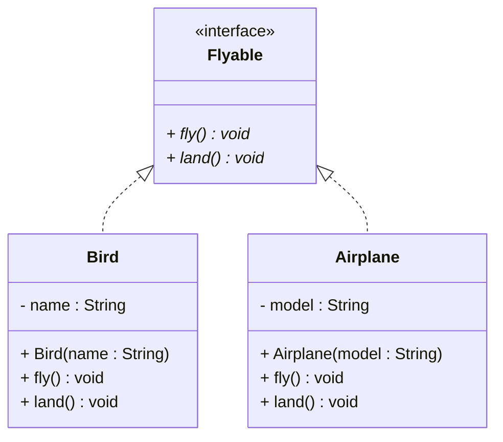
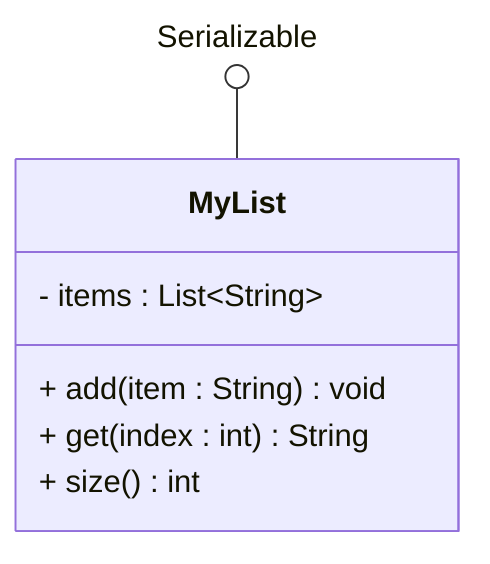
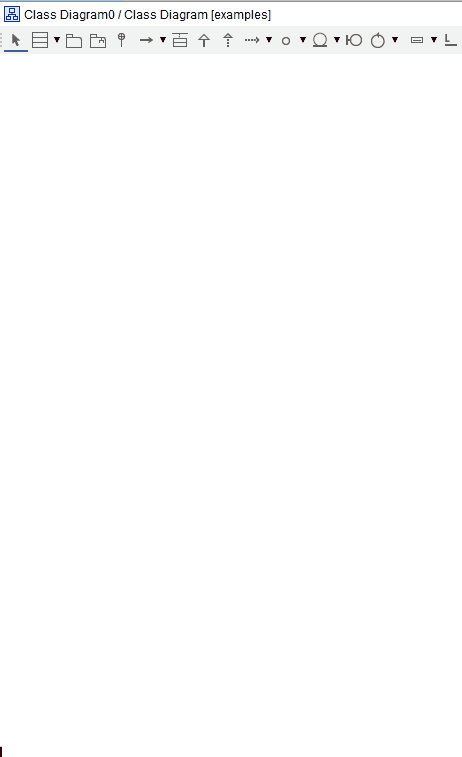
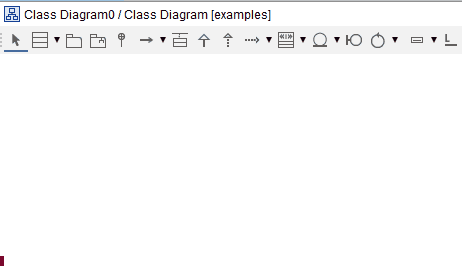

# Interfaces in UML

We can represent interfaces in UML in two ways:
- normal interface, looks like a class with a `<<interface>>` _stereotype_
- lollipop interface, looks like a circle with a line coming out of it.

You will use the normal interface, when you have created the interface yourself.\
You will use the lollipop interface, when you are using an interface from the Java library, or is somehow otherwise common knowledge.

## Representing interfaces in UML

### Normal Interface Notation

At the top we have the `Flyable` interface, marked with the `<<interface>>` stereotype.\

## Coloring interfaces

I like to have all my interfaces in a specific color, pick something pale, not too bright. I have a pale yellow, see below.

### Lollipop Interface Notation

Here is the lollipop notation. 

I like to hide the attribute compartment, because it is _typically_ not relevant for the interface.

## Adding Interfaces in Astah

The tool is found in the toolbar.

### Normal interface

### Lollipop Interface

The lollipop interface is found in the same toolbar menu as the normal interface box.

