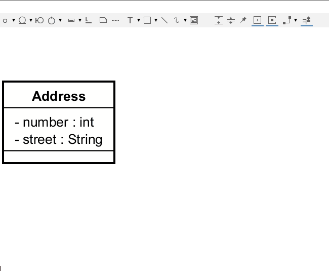

# Notes in UML

This may not really be a UML thing, but it is a useful thing to know. You can add notes to the diagram, and attach the note to an element, or part of an element.

Observe below. Notice how one note is attached to the class, and one to the attribute.

