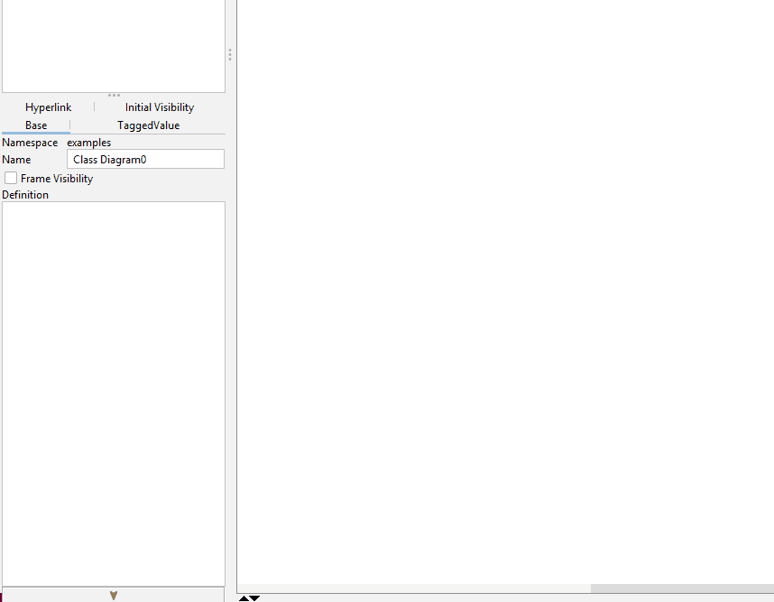

# Enums in UML

I am not sure this is UML format, but I have a suggestion for how to represent enums in UML.

- You use a class.
- You give it the `<<enum>>` stereotype.
- You add the values as constants.
- You hide the operation compartment.
- You hide the attribute type.
- You hide the attribute visibility.

Here I make a Color enum.

