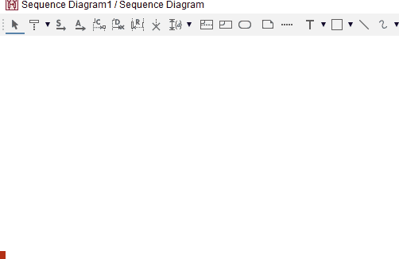
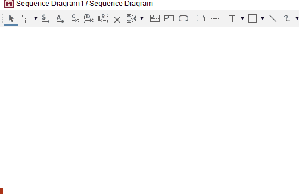
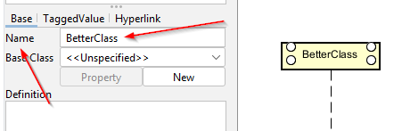

# Adding classes

The default element in a sequence diagram is a class. This means you can just double click anywhere on the diagram to add a new class.

Alternatively, select the tool from the toolbar.

You can then name the class.

The class in Astah is called a "lifeline". That's probably because the diagram can show various things, that are not necessarily classes or even Java oriented.

## Double clicking

## Selecting the tool

## Naming the class

Either double click on the class name in the diagram.

Or select the class, and find the name input field in the left side properties pane.

