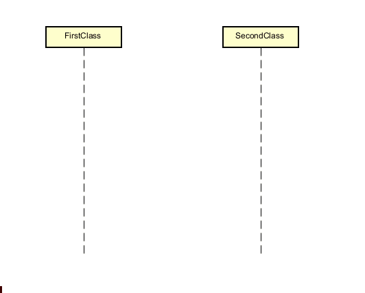
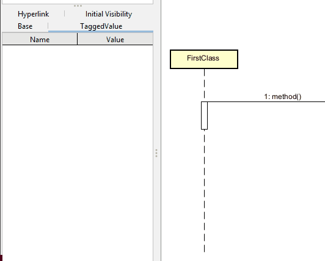
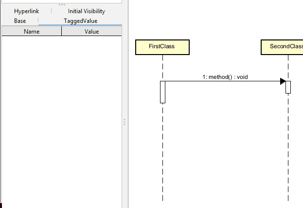
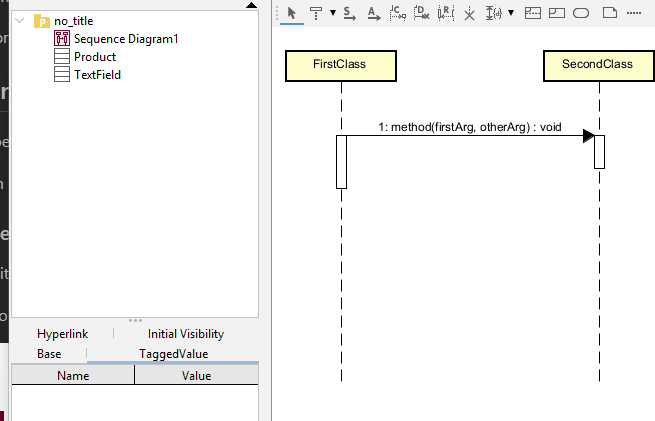

# Method calls

The activation bars are only visible when you are adding a method call. In Astah, an activation bar cannot not be added independently.

Therefore, you must have two classes first.

## Adding the arrow
The type of arrow we are looking for is called a "Message". In Astah, this is represented by an S on a little arrow.

You can do mouse over, or you can select the tool from the toolbar.

### Mouse over

Notice it's the `S` on the arrow, we are looking for. Not `A`, it is the `S` that is important.

Drag from one time line to the other, and you automatically get the activation bars.

You can name the method, and the `( )` will be added automatically. See below for specifying return type and arguments. This is surprisingly annoying to do.

### Selecting the tool

So, you select the tool, click the first class, then the second class, and you will see the message arrow.

## Adding return type

If you want a to specify a return type, this is found in the left side properties pane.\
Select the method name in the diagram, and find the "Return type" field to the left. 

Observe:

## Adding arguments

And finally, you can add arguments. But, you can only set the name of the argument, not the type.

## Adding return arrow

All method calls should have a return arrow. This is found in the toolbar. It's called "Reply message". It should automatically snap to the bottom of the activation bar, on the right. 

You can also add a name for whatever value is returned. 

Here: 

