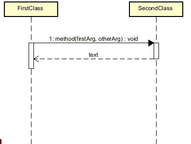

# Method life times

Not much to explain here, but you can make them longer or shorter, just by selecting and dragging the anchor points.

This can help you with clearer organization of the diagram.

