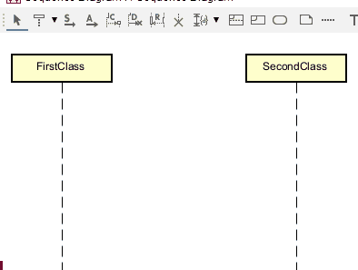

# Constructors

... or having one class instantiate another.

This requires a special kind of arrow, called "Create message", found in the toolbar.

The name of the arrow should then be the name of the constructor, i.e. the class name, along with the `( )` for whatever arguments are needed.

Notice how the created class is lowered slightly, relative to the class that is creating it.

The vertical positioning of the second class is determined by where you drag the arrow _from_. If you drag from higher or lower, the second class will be positioned accordingly. And, afterwards, you can just reposition the second class to your liking.