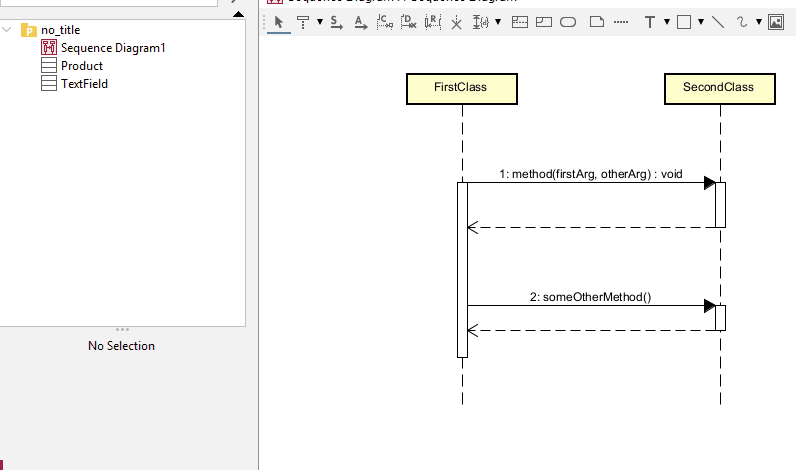
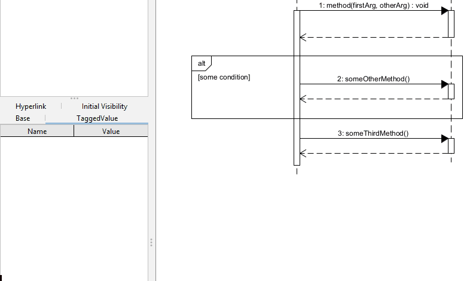

# Decisions

... or if-statements. And if-else-statements. And if-else-if-else-statements. But no switch statements, so in that case you will have to abuse the if-statements.

In Astah, it is called an "alt", for "alternative". The tool is "CombinedFragment".

You draw a box around the if-stuff, and name the guard meaningfully.

If you move the box, everything inside the box will move with it.

If you need to move the box, without moving the contents, select the box, and drag one of the anchor points (white dots).

## Adding the alt box

## Adding else boxes

