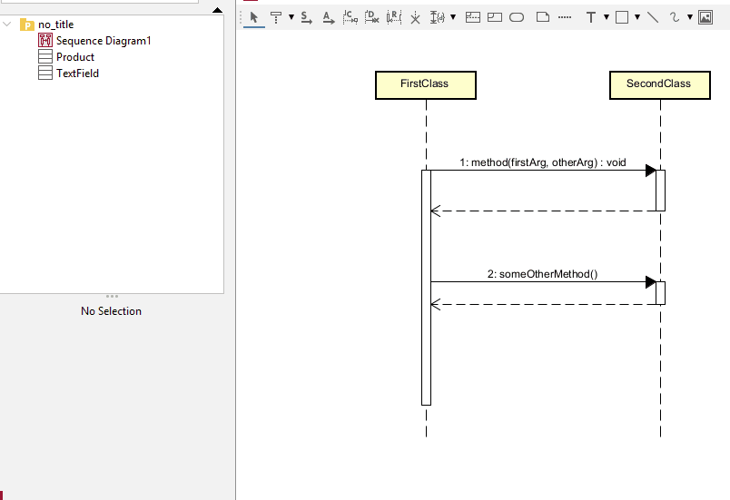

# Loops

This is the same box as earlier. 

In Astah, it is called an "alt", for "alternative". The tool is "CombinedFragment".

You just have to change the "alt" to a "loop".

Explain the loop condition in the guard.

