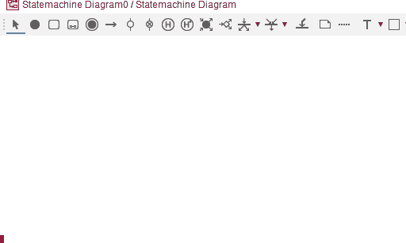

# Adding a state

The State is the default shape in this diagram. That means there are two ways to add a state to the diagram.

## Double clicking

Double click anywhere on the diagram, to add a new state.

Give the state a name.

## Selecting the tool

Select the tool from the toolbar. Click on the diagram, and you will see the state shape.

