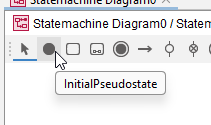
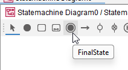

# Start and end

All state machines must have a start. Some state machines may have an end.

Both are found in the toolbar.

## Start

It's a filled black circle.

Select the tool, click on the diagram, and you will see the start shape.

## End

It's a filled black circle, with a black circle around it.

Select the tool, click on the diagram, and you will see the end shape.