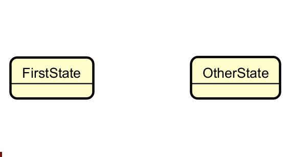
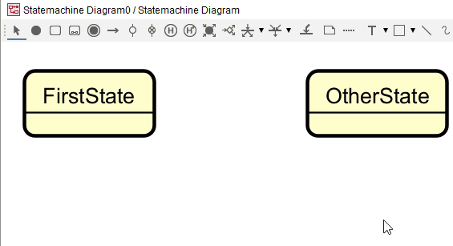

# Transitions

These are the arrows that connect the states.

As with most relationships, there are two ways to add a transition.

## Mouse over

When you mouse over a state, sort of close to an edge, you will see a little "-->" icon.

Click and drag the arrow to the target state. The name of the _trigger_ will be editable. Here you write the name of the event that triggers the transition.

## Using the tool

Alternatively, you can select the tool from the toolbar. Click on the initial state, and then the target state. And then name the transition.

