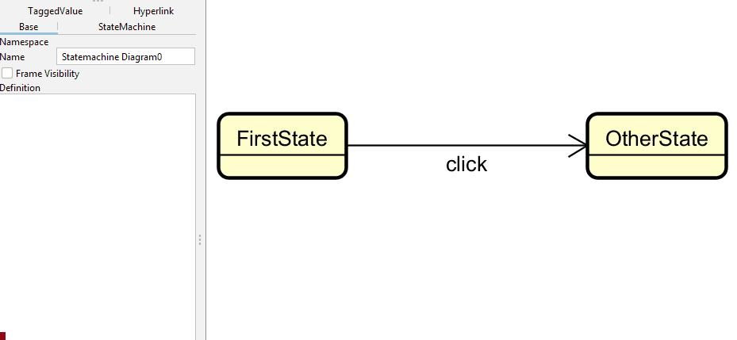
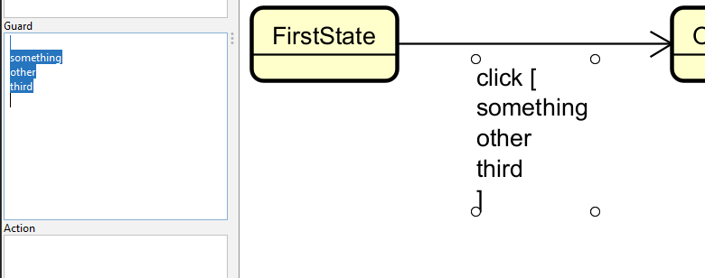
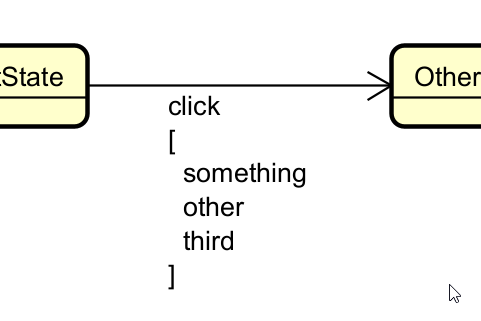

# Transition guards

You can add guards to transitions. This is done by selecting a transition, and finding the guard in the left side menu.

If you have multiple guards, the formatting can be a bit off. I suggest making new lines for each guard, _and_ before the first, _and_ after the last.

Is is far from pretty. You can have them all on one line, comma-separated, but then the transition name gets long. Play around with the formatting to get it to look nice.

You can also add a line break after the transition name:

