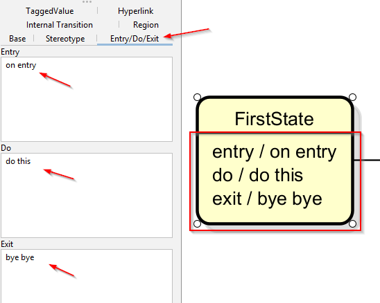
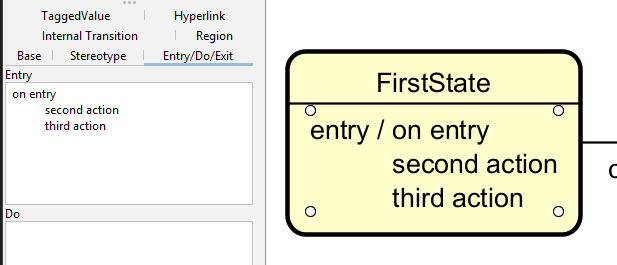

# State actions

You can add three type of actions to a state:
- Entry actions
- Exit actions
- Do actions

These are found in the left side menu, once a state is selected.

And here, again, if you have multiple actions, the formatting can be a bit iffy. I recommend making new lines, and perhaps also some white space before all actions after the first, so they are somewhat alligned:

