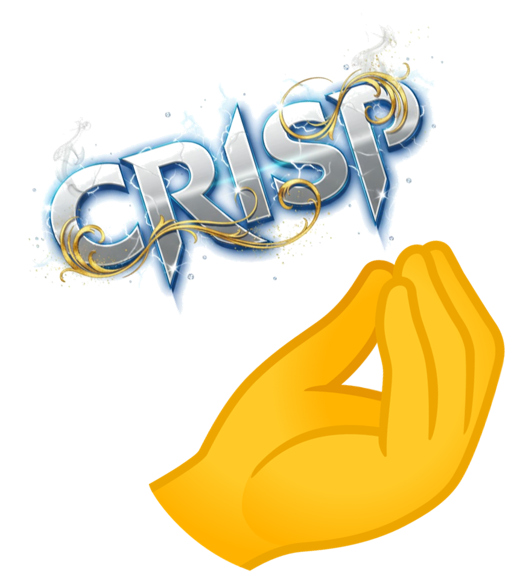

# Introduction

.svg is a file format for vector graphics: scalable vector graphic. That means the diagram is not based on colouring pixels, but rather on shapes and paths, which are just defined by coordinates, and functions, i.e. math.

Because of this, you can zoom in and out, and the lines will not become fuzzy, they will just regenerate to now match the correct zoom level.

This is great for all your diagrams in your report. We do not want blurry, pixelated, unreadable diagrams.

Therefore, this learning path explains how to export your diagrams to .svg format from Astah. And also how to convert your word documents to .svg format.

Consider the two below diagrams, which represent the same information, but are exported in different formats.

First a png (I have overdone it a bit, but we regularly see this quality in project reports):

And now a .svg:

Notice how crisp this is. You can right click, and open in new tab, and zoom in and out, and the lines will not become fuzzy, they will just regenerate to now match the correct zoom level.  

> Beautiful. Absolutely beautiful!

