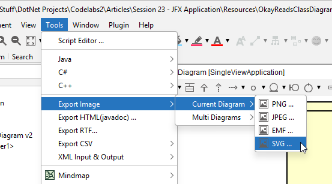

# How to export to .svg in Astah

It's simple. Here:

You may notice, there is also a .png option.

> Do not touch this!

Great, now you have your .svg file. But! There are still ways to fuck up. My students are industriously stupid. Some of them. Not _you_, currently reading this, of course not. But those other students. You know who I am talking about.

So, do keep reading.