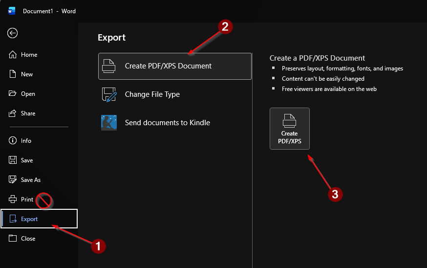

# How to not mess up with word

Say you write your report in word. You have that wonderful diagram in .svg format. You want to include it in your report. Just put it in the word document, easy.

Then you need to make it into a pdf for handing the project.

> Here is where you mess up.

Not _you_, of course not. But those other students, I mentioned. Who did not read these instructions.

You have two ways to create a pdf.

- _Print_ to pdf ❌ <-- ThIs NoT tHe CoRrECT wAy!!! The printer program will compress your file.
- _Export_ to pdf ✅ <-- This is the correct way. 

Here:

