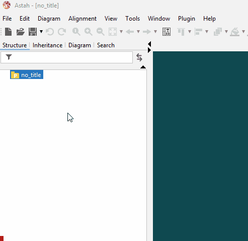
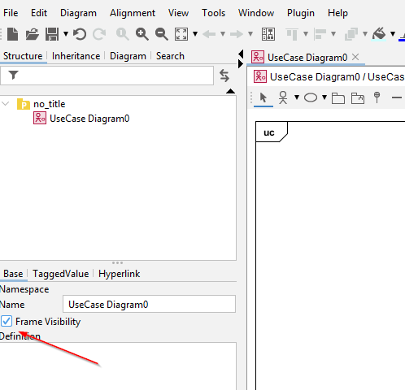

# New diagram in Astah

Creating a new Use Case Diagram in Astah is done as follows:

Now you have a file, next we add use cases to it.

The diagram starts out with a box, and a title of "uc" at the top left.\
I prefer to remove this frame:

