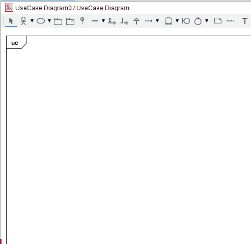
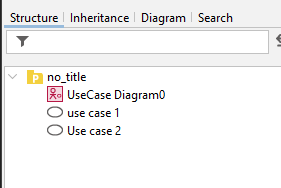

# Adding a use case bubble

To add a bubble, you have two options:
- Double click in the diagram area
- Select the bubble icon in the toolbar, then single clicking in the diagram area

Now, in your structure overview panel on the left, you should see the new use case bubbles:

