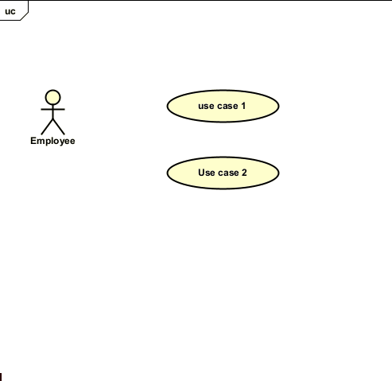

# Lines between actor and use case

Connecting an actor to a use case is done by drawing a line from the actor to the use case.

Make sure nothing is selected, by click on some blank part of the diagram area.

You mouse over the actor, and depending which part, you will see that little "draw line" icon, with the expand-menu-arrow.

These lines are conventionally straight.j