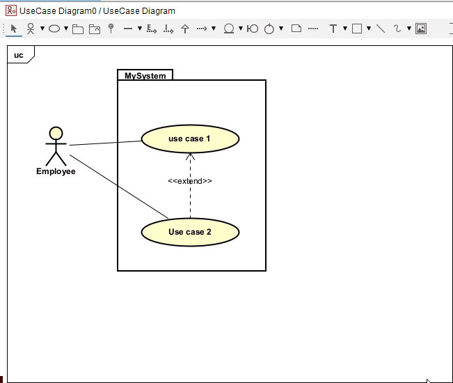

# Adding comments

Sometimes it can be useful to add comments. Maybe because a use case includes several user stories, or maybe because.... eh... I don't know.

Notice the note line is drawn _from_ the note, _to_ the use case. 

The available lines are determined by where you are dragging them from.