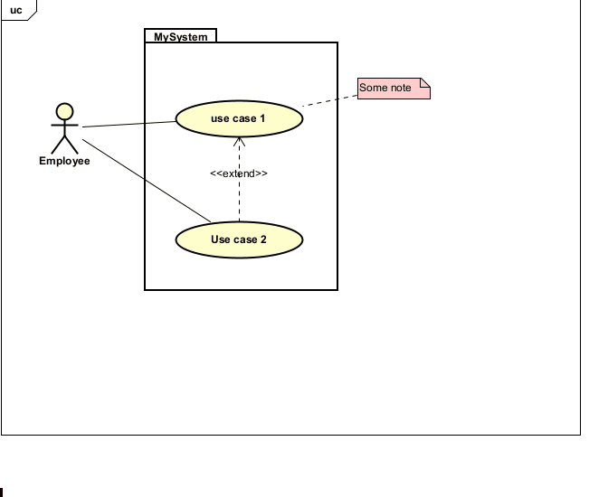

# Adding a description

This requires a use case diagram. You can only add a description to an existing use case bubble.

You just right click on a bubble, and select "Add Description". You can then see it in the structure overview panel on the left.

